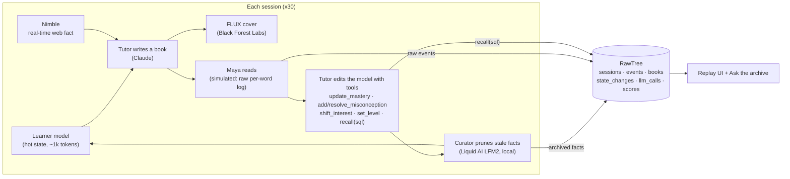

# Chapters: a tutor that grows with the kid

**Long Horizon Agents Hack · solo project**

Long-running agents fail slowly. They keep appending history to their prompt, and eventually the prompt holds more *stale* truth than *current* truth. Chapters is a reading tutor that runs a whole semester with one child. It keeps a **small, editable learner model** in its prompt, and everything it lets go of goes into an archive it can query with SQL.

We run two tutors on the same simulated child, Maya (age 7), for 30 sessions:

| | 🦉 Transcript Owl (baseline) | 🦊 Chapters Fox (ours) |
|---|---|---|
| What's in the prompt | the full conversation: every book and every raw reading log | a ~1k-token learner model: level, skills, misconceptions, interests, what works |
| How memory changes | append-only | the tutor **edits** its model with tools; a local curator **prunes** stale facts |
| Old facts | stay in the prompt forever | archived to **RawTree**, and brought back with `recall(sql)` when needed |

Maya is designed to be hard to follow. She masters skills and then **slips back** after a break. Her reading level goes **up, down, and up again**. She moves from dinosaurs to the ocean to space and then **back to dinosaurs**. Her signals are quiet and raw, like a real classroom: a per-word reading log `[word, ms, correct]`, a 1–5 enjoyment rating, and the occasional remark. Neither tutor gets pre-computed skill labels.

<!-- RESULTS -->

## The demo


- **Reading Trail:** the semester as a board game. Maya hops stone to stone, and the landscape follows her interests. The Owl carries a backpack of history that swells every session; the Fox carries a notebook and drops stale pages as leaves onto the **RawTree**.
- **Race HUD:** ⭐ stars earned (right level, right topic, right skill for the *real* Maya), 🎒 prompt tokens, and 🪙 money spent.
- **Bookshelves:** each tutor's book for the session, with a FLUX watercolor cover. When a book misses the real Maya, it gets a red *STALE* ribbon with the reason ("still thinks: loves space", "drilling vowel teams, already mastered").
- **The tutor's mind:** Chapters' live learner model as cards. Archived facts fall into the *Archive · RawTree* drawer.
- **Charts:** prompt tokens, cumulative cost, and accuracy against ground truth, all queried from RawTree.
- **Ask the archive:** a natural-language question becomes read-only SQL on RawTree, and the page shows both the answer and the SQL.
- **Read to me:** in the book modal, the browser reads the story aloud and highlights each word as it's spoken (Web Speech API).

The UI **replays** a precomputed semester from RawTree, so it never waits on a live LLM call to render.

## Architecture



The baseline runs the same book-writing step, but its prompt is the whole transcript: no learner model, no pruning.

## How each sponsor tool is used

| Sponsor | Role |
|---|---|
| **RawTree (Tinybird)** | The archive and the single source of truth for the dashboard. Six tables are created automatically on first insert. The Chapters tutor queries its own past with a `recall(sql)` tool, "Ask the archive" turns questions into SQL, and every chart, gauge and archive drawer is read from RawTree. Each session is written as one `batch`, so a crash never double-counts. |
| **Nimble** | Before each book, the tutor fetches a real, current web result about the interest it *believes* Maya has, and the fact is woven into the story (the source is shown in the book modal). |
| **Liquid AI LFM2 (1.2B, GGUF)** | The curator, running **locally in Ollama** between sessions. It decides which facts are stale (resolved misconceptions, faded interests, duplicate insights) and why. A rule-based backstop means pruning never depends on a small model producing perfect JSON. |
| **Black Forest Labs FLUX** | One warm watercolor picture-book cover per book (60 total), in a consistent style with the same Maya character. |
| Claude (`claude-opus-5`) | Writes the books and edits the learner model. Both tutors use the same model, so the only difference is how memory is handled. |

## Run it

```bash
npm install
cp .env.example .env.local        # fill in the keys
ollama pull hf.co/LiquidAI/LFM2-1.2B-GGUF:Q4_K_M

npm run smoke                     # one tiny call per sponsor
npm run simulate                  # 30 sessions, both tutors; resumable
npm run covers                    # paint any missing FLUX covers (parallel)
npm run dev                       # http://localhost:3000
```

- `npm run simulate -- --run test --sessions 3 --no-covers`: a quick end-to-end check.
- `npm run backfill`: pushes a locally checkpointed run to RawTree.
- `http://localhost:3000/?s=22`: jumps to a session. Use ← → to step and space to play.

## Honest notes

- Maya is simulated with fixed rules and a fixed random seed. Her ground truth, which the scorer uses, is never shown to either tutor.
- Both tutors use the same LLM, the same writer prompt, the same Nimble tool and the same raw observations. The only variable is memory.
- Accuracy is a strict 3-point fit per book (level, topic, target skill) against ground truth.

## Next steps

- **Real reading, not simulated reading.** In production the child reads each book aloud. Speech recognition aligns their voice with the text and produces the same per-word events (`word`, `ms`, `correct`) that feed the learner model today. The "Read to me" button already runs the reverse direction in the browser.
- A teacher view that edits the learner model directly, with every edit logged to RawTree.
- Longer horizons (a full school year) and multiple kids, where a bounded prompt matters even more.
